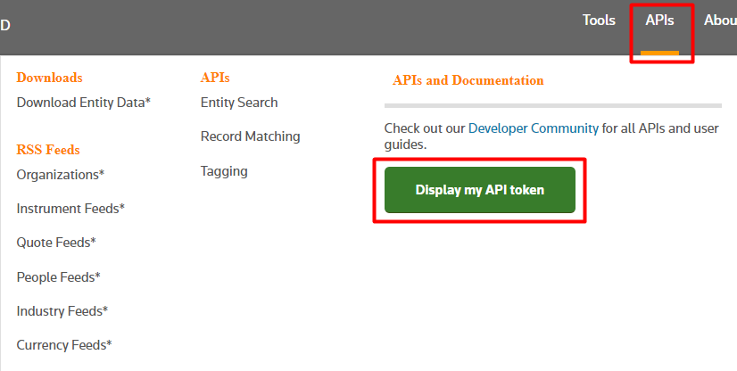
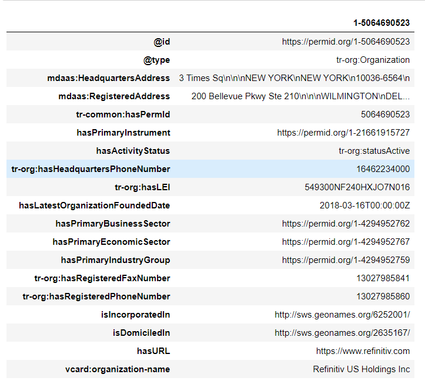
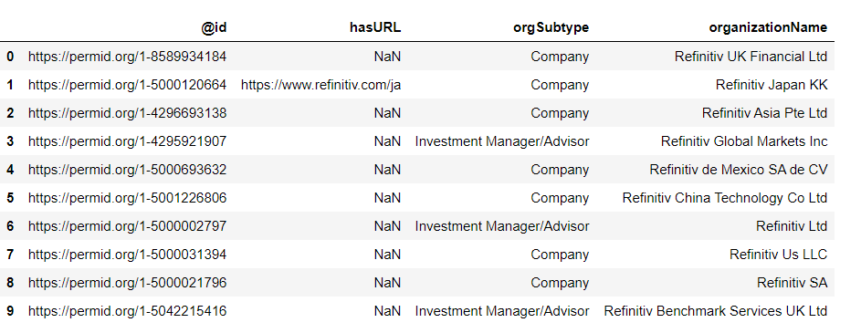
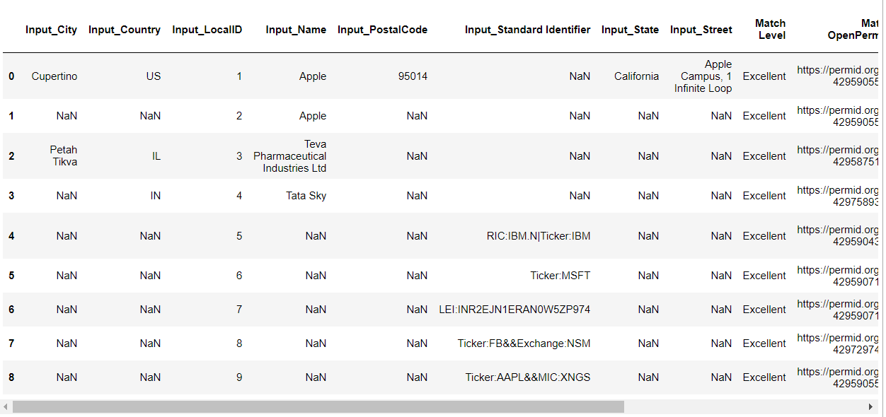
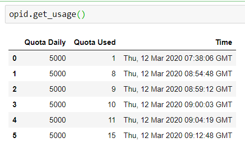

# Python: Open PermID APIs

## Overview
This article introduces a Python library for Open PermID APIs. This library covers all features of Open PermID APIs including Record Matching, Entity Search, and Intelligent Tagging. 


## Open PermID
PermID is a shortening of “Permanent Identifier” which is a machine-readable number assigned to entities, securities, organizations (companies, government agencies, universities, etc.), quotes, individuals, and more. It is specifically designed for use by machines to reference related information programmatically. Open PermID is publicly available for free at [https://permid.org/](https://permid.org/).

 Open PermID also supports several APIs.
- **Open PermID - Record Matching - RESTful API**

Make a request to the Record Matching API to obtain matches to Refinitiv Open PermID on a collection of Organizations, Instruments, Quotes or Persons

- **Open PermID - Entity Search · RESTful API**

Use the Entity Search API to look up the PermID, or search the PermID by name, ticker, or RIC

- **Intelligent Tagging - RESTful API**

Intelligent Tagging is a sophisticated web service designed to let people in the financial domain extract insight from unstructured content. It also maps the metadata-tags in the tagging output to Refinitiv unique IDs

## Python OpenPermID Usage


### 1. Installation

The Python OpenPermID is available on [pypi.org](https://pypi.org/project/OpenPermID/). It can be installed via the following **pip** command.

```
pip install OpenPermID
```

It supports Python 3.

### 2. Initialization

To use the Python OpenPermID, the application needs to create an OpenPermID object and set an access token to it. 

```Python
from OpenPermID import OpenPermID

opid = OpenPermID()
opid.set_access_token("<API Token>")

```


The access token can be retrieved after login to the [Open PermID](https://permid.org/) website. Then, select **APIs** and **Display my API token**.   



### 3. Entity Lookup

This function is used to look up the entity information by the PermID. 

```
lookup(id, format='dataframe', orient='row')
```

It accepts three parameters:

|Parameter Name|Required|Description|
|--------------|--------|-----------|
|id|Yes|The PermID used to lookup e.g. 1-5064690523|
|format|No|The format of the output. Possible values are **dataframe**, **json-ld**, or **turtle**. The default value is **dataframe**|
|orient|No|The format of the returned data frame. Possible values are **row**, or **column**. The default value is **row**|

This function returns a tuple containing a result and error string. The result could be a data frame, JSON, or turtle string depending on the **format** parameter.

__**Sample Usages**__

- **Call the lookup method to retrieve the entity information of the 1-5064690523 PermID with the default parameters**

```Python
df,err = opid.lookup("1-5064690523")
```
It uses the default values of the **format** and **orient** parameters, so the returned result is a data frame with the row orient.


- **Call the lookup method to retrieve the entity information of the 1-5064690523 PermID with the 'column' orient parameter**

```Python
df,err = opid.lookup("1-5064690523", orient="column")
```
The returned result is a data frame with the column orient.



- **Call the lookup method to retrieve the entity information of the 1-5064690523 PermID with the 'json-ld' format parameter**

```Python
output,err = opid.lookup("1-5064690523", format="json-ld")
```
The returned result is a JSON string.
```
{
  "@id" : "https://permid.org/1-5064690523",
  "@type" : "tr-org:Organization",
  "mdaas:HeadquartersAddress" : "3 Times Sq\n\n\nNEW YORK\nNEW YORK\n10036-6564\n",
  "mdaas:RegisteredAddress" : "200 Bellevue Pkwy Ste 210\n\n\nWILMINGTON\nDELAWARE\n19809-3709\nUnited States\n",
  "tr-common:hasPermId" : "5064690523",
  "hasPrimaryInstrument" : "https://permid.org/1-21661915727",
  "hasActivityStatus" : "tr-org:statusActive",
  "tr-org:hasHeadquartersPhoneNumber" : "16462234000",
  "tr-org:hasLEI" : "549300NF240HXJO7N016",
  "hasLatestOrganizationFoundedDate" : "2018-03-16T00:00:00Z",
  "hasPrimaryBusinessSector" : "https://permid.org/1-4294952762",
  "hasPrimaryEconomicSector" : "https://permid.org/1-4294952767",
  "hasPrimaryIndustryGroup" : "https://permid.org/1-4294952759",
  "tr-org:hasRegisteredFaxNumber" : "13027985841",
  "tr-org:hasRegisteredPhoneNumber" : "13027985860",
  "isIncorporatedIn" : "http://sws.geonames.org/6252001/",
  "isDomiciledIn" : "http://sws.geonames.org/2635167/",
  "hasURL" : "https://www.refinitiv.com",
  "vcard:organization-name" : "Refinitiv US Holdings Inc",
  "@context" : {
    "HeadquartersAddress" : {
      "@id" : "http://ont.thomsonreuters.com/mdaas/HeadquartersAddress",
      "@type" : "http://www.w3.org/2001/XMLSchema#string"
...
```

### 4. Entity Search

This function is used to search an entity's PermID value from a string. 
```
serach(q, entityType='all', format="dataframe", start=1, num=5, order='rel')
```
|Parameter Name|Required|Description|
|--------------|--------|-----------|
|q|Yes|A query string to search for. It could be either just the search string value, or prefix it with "<fieldname>:" to constrain the search to a specific field, such as "**refinitiv**", "**ticker:IBM**", and "**ticker: msft AND exchange:NSM**". For a list of all available fields, please refer to the [PermID User guide](https://developers.refinitiv.com/open-permid/permid-entity-search/docs?content=4885&type=documentation_item).|
|entityType|No|The type of entity to search for. Possible values are **all**, **organization**, **instrument**, or **quote**. The default value is **all**|
|format|No|The format of the output. Possible values are **dataframe**, **json**, or **xml**. The default value is **dataframe**|
|start|No|The index of the first result returned, in the list of results ordered according to the order parameter. The index is 1-based. The default value is 1.|
|num|No|The maximum number of results returned for each entity (separately). Possible values are 5, 10, 20, 50, and 100. The default value is 5.|
|order|No|The order of the search results. Possible values are **rel** (Descending order of relevance), **az** (Ascending alphabetical order of the entity name), or **za** ( Descending alphabetical order of the entity name). The default value is **rel**.|

This function returns a tuple containing a result and error string. When the **entityType** is **all** and the **format** is **dataframe**, it returns multiple data frames indexed by the entity types (**quotes**, **organizations**, and **instruments**). For other entity types with the **dataframe** format, it returns a data frame. The result could be a data frame, JSON, or XML string depending on the **format** parameter. 

__**Sample Usages**__

- **Call the search method to search for a "Refinitiv" string with the default parameters**
```Python
output,err = opid.search('Refinitiv')
output['quotes']
output['organizations']
output['instruments']
```
The default value of the entityType parameter is **all** so the returned result contains multiple data frames indexed by the entity types.


- **Call the search method to search for a "Refinitiv" string with 'organization' and 10 for the entityType and num parameters respectively**
```Python
output,error = opid.search('Refinitiv',entityType='organization', num=10)
output
```
The returned result is a data frame containing 10 entries of the **organization** entity type.



- **Call the search method to search for an "IBM" string with 'quote' and 'json' for the entityType and format parameters respectively** 
```
output,err = opid.search('IBM',entityType='quote',format='json')
```
The returned result is a JSON string.
```
{
  "result": {
    "quotes": {
      "entityType": "quotes",
      "total": 173,
      "start": 1,
      "num": 5,
      "entities": [
        {
          "@id": "https://permid.org/1-55838323096",
          "hasName": "INTERNATIONAL BUSINESS MACHINES ORD",
          "assetClass": "Ordinary Shares",
          "isQuoteOfInstrumentName": "International Business Machines Ord Shs",
          "hasRIC": "IBM.N",
          "hasMic": "XNYS",
          "hasExchangeTicker": "IBM",
          "isQuoteOf": "https://permid.org/1-8590927768"
        },
        {
          "@id": "https://permid.org/1-55839165994",
          "hasName": "INTERNATIONAL BUSINESS MACHINES ORD",
          "assetClass": "Ordinary Shares",
          "isQuoteOfInstrumentName": "International Business Machines Ord Shs",
          "hasRIC": "IBM",
          "hasMic": "XXXX",
          "hasExchangeTicker": "IBM",
          "isQuoteOf": "https://permid.org/1-8590927768"
        },
        {
          "@id": "https://permid.org/1-21475465740",
          "hasName": "IBM SOUTH AFRICA",
          "assetClass": "Ordinary Shares",
          "isQuoteOfInstrumentName": "IBM South Africa Common Stock",
          "hasRIC": "IBMZF.PK^H09",
          "hasExchangeTicker": "IBMZF",
          "isQuoteOf": "https://permid.org/1-8590025323"
        },
        {
          "@id": "https://permid.org/1-21475582828",
          "hasName": "IBM ORD",
          "assetClass": "Ordinary Shares",
          "isQuoteOfInstrumentName": "International Business Machines Ord Shs",
          "hasRIC": "IBM.B^J07",
          "hasExchangeTicker": "IBM",
          "isQuoteOf": "https://permid.org/1-8590927768"
        },
        {
          "@id": "https://permid.org/1-21475582861",
          "hasName": "IBM ORD",
          "assetClass": "Ordinary Shares",
          "isQuoteOfInstrumentName": "International Business Machines Ord Shs",
          "hasRIC": "IBM.S^K08",
          "hasExchangeTicker": "IBM",
          "isQuoteOf": "https://permid.org/1-8590927768"
        }
      ]
    }
  }
}
```
### 5. Record Matching

The PermID Record Matching API allows you to match entity Person, Organization, Instrument,
and Quote records with Refinitiv’ PermIDs. 

```Python
match(data,dataType='Organization',numberOfMatchesPerRecord=1,raw_output=False)
```
|Parameter Name|Required|Description|
|--------------|--------|-----------|
|data|Yes|A CSV string or data frame for matching. For formats of the CSV string, please refer to the [PermID User guide](https://developers.refinitiv.com/open-permid/permid-entity-search/docs?content=4885&type=documentation_item).|
|dataType|No|The type of entity to search for. Possible values are **Person**, **Organization**, **Instrument**, or **Quotation**. The default value is **Organization**.|
|numberOfMatchesPerRecord|No|A number of possible matches to output for each record in the input. The maximum number of possible matches is 5. The default value is 1.|
|raw_output|No|A boolean value set to retrieve a result as a JSON string instead of a data frame. The default value is False which returns a data frame.|

This function returns a tuple containing a result and error string. The result could be a data frame, or JSON string depending on the **raw_output** parameter.

__**Sample Usages**__

- **Call the match method to match the organization entities with a CSV string**
```Python
organization="""
LocalID,Standard Identifier,Name,Country,Street,City,PostalCode,State,Website
1,,Apple,US,"Apple Campus, 1 Infinite Loop",Cupertino,95014,California,
2,,Apple,,,,,,
3,,Teva Pharmaceutical Industries Ltd,IL,,Petah Tikva,,,
4,,Tata Sky,IN,,,,,
5,RIC:IBM.N|Ticker:IBM,,,,,,,
6,Ticker:MSFT,,,,,,,
7,LEI:INR2EJN1ERAN0W5ZP974,,,,,,,
8,Ticker:FB&&Exchange:NSM,,,,,,,
9,Ticker:AAPL&&MIC:XNGS,,,,,,,
"""
output,err = opid.match(inputStr)
```
The returned result is a data frame.


- **Call the match method to match the person entities with a data frame**
```
person = pd.DataFrame(columns = ['LocalID',
                                 'FirstName',
                                 'MiddleName',
                                 'PreferredName',
                                 'LastName',
                                 'CompanyPermID',
                                 'CompanyName',
                                 'NamePrefix',
                                 'NameSuffix']) 
person = person.append(pd.Series(['1','Satya','','','Nadella','','Microsoft Corp','',''], 
                                 index=person.columns),ignore_index=True)
person = person.append(pd.Series(['2','Satya','','','Nadella','4295907168','','',''], 
                                 index=person.columns),ignore_index=True)
person = person.append(pd.Series(['3','Martin','','','Jetter','','International Business Machines Corp','',''], 
                                 index=person.columns),ignore_index=True)
person = person.append(pd.Series(['4','Bill','','','Gates','','Microsoft Corp','',''], 
                                 index=person.columns),ignore_index=True)
output,err = opid.match(person, dataType='Person')
```
The returned result is a data frame.


- **Call the match method to match the Quotation entity with a CSV string and return a JSON string**
```
quotation="""
LocalID,Standard Identifier
1,RIC:IBM.N|Ticker:IBM
2,Ticker:MSFT
3,RIC:IBM.N&&Ticker:IBM
"""
output,err = opid.match(quotation, dataType='Quotation',raw_output=True)
```
The returned result is a JSON string.
```
{
  "ignore": "      ",
  "unMatched": 0,
  "matched": {
    "total": 3,
    "excellent": 3
  },
  "numReceivedRecords": 3,
  "numProcessedRecords": 3,
  "numErrorRecords": 0,
  "headersIdentifiedSuccessfully": [
    "localid",
    "standard identifier"
  ],
  "headersNotIdentified": [],
  "headersSupportedWereNotSent": [],
  "errorCode": 0,
  "errorCodeMessage": "Success",
  "resolvingTimeInMs": 33,
  "requestTimeInMs": 33,
  "outputContentResponse": [
    {
      "ProcessingStatus": "OK",
      "Match OpenPermID": "https://permid.org/1-55838323096",
      "Common Name": "INTERNATIONAL BUSINESS MACHINES ORD",
      "Match Level": "Matched",
      "Match Ordinal": "1",
      "Original Row Number": "2",
      "Input_LocalID": "1",
      "Input_Standard Identifier": "RIC:IBM.N|Ticker:IBM"
    },
    {
      "ProcessingStatus": "OK",
      "Match OpenPermID": "https://permid.org/1-55835377165",
      "Common Name": "MICROSOFT ORD",
      "Match Level": "Matched",
      "Match Ordinal": "1",
      "Original Row Number": "3",
      "Input_LocalID": "2",
      "Input_Standard Identifier": "Ticker:MSFT"
    },
    {
      "ProcessingStatus": "OK",
      "Match OpenPermID": "https://permid.org/1-55838323096",
      "Common Name": "INTERNATIONAL BUSINESS MACHINES ORD",
      "Match Level": "Matched",
      "Match Ordinal": "1",
      "Original Row Number": "4",
      "Input_LocalID": "3",
      "Input_Standard Identifier": "RIC:IBM.N&&Ticker:IBM"
    }
  ]
}
```

### 6. Record Matching File

This method is similar to the above **match** method. It is used to match the entity Person, Organization, Instrument, and Quote records with Refinitiv’s PermIDs. However, instead of passing a string or data frame, it accepts a file name that contains records to be matched.

```Python
matchFile(filename,dataType='Organization',numberOfMatchesPerRecord=1,raw_output=False)
```
|Parameter Name|Required|Description|
|--------------|--------|-----------|
|filename|Yes|A filename of the CSV file containing records to be matched. Templates for the CSV files can be downloaded at the [Record Matching](https://permid.org/match) website.|
|dataType|No|The type of entity to search for. Possible values are **Person**, **Organization**, **Instrument**, or **Quotation**. The default value is **Organization**.|
|numberOfMatchesPerRecord|No|A number of possible matches to output for each record in the input. The maximum number of possible matches is 5. The default value is 1.|
|raw_output|No|A boolean value set to retrieve a result as a JSON string instead of a data frame. The default value is False which returns a data frame.|

This function returns a tuple containing a result and error string. The result could be a data frame or JSON string depending on the **raw_output** parameter.

__**Sample Usages**__

- **Call the matchFile method to match records in an organization CSV file**

```Python
output,err = opid.matchFile("Organization_input.csv")
```
The returned result is a data frame.



- **Call the matchFile method to match records in a person CSV file and return a JSON string**
```Python
output,err = opid.matchFile('Person_input.csv', dataType='Person', raw_output=True)
```
The returned result is a JSON string.
```
{
  "ignore": "          ",
  "uploadedFileName": "Person_input.csv",
  "unMatched": 0,
  "matched": {
    "total": 7,
    "excellent": 4,
    "good": 3
  },
  "numReceivedRecords": 7,
  "numProcessedRecords": 7,
  "numErrorRecords": 0,
  "headersIdentifiedSuccessfully": [
    "localid",
    "firstname",
    "middlename",
    "preferredname",
    "lastname",
    "companypermid",
    "companyname",
    "nameprefix",
    "namesuffix"
  ],
  "headersNotIdentified": [],
  "headersSupportedWereNotSent": [],
  "errorCode": 0,
  "errorCodeMessage": "Success",
  "resolvingTimeInMs": 5517,
  "requestTimeInMs": 5517,
  "outputContentResponse": [
    {
      "ProcessingStatus": "OK",
      "Match Score": "0.75",
      "Match Level": "Good",
      "Match Ordinal": "1",
      "Original Row Number": "2",
      "Input_LocalID": "1",
      "Match OpenPermID": "https://permid.org/1-34413262612",
      "Match First Name": "Satya",
      "Match Last Name": "Nadella",
      "Match OrgOpenPermID": "https://permid.org/1-4295907168",
      "Match OrgName": "MICROSOFT CORPORATION",
      "Input_First Name": "Satya",
      "Input_Last Name": "Nadella",
      "Input_OrgName": "Microsoft Corp"
    },
    {
      "ProcessingStatus": "OK",
      "Match Score": "0.95",
      "Match Level": "Excellent",
      "Match Ordinal": "1",
      "Original Row Number": "3",
      "Input_LocalID": "2",
      "Match OpenPermID": "https://permid.org/1-34413262612",
      "Match First Name": "Satya",
      "Match Last Name": "Nadella",
      "Match OrgOpenPermID": "https://permid.org/1-4295907168",
      "Match OrgName": "MICROSOFT CORPORATION",
      "Input_First Name": "Satya",
      "Input_Last Name": "Nadella",
      "Input_OrgOpenPermID": "https://permid.org/1-4295907168"
    },
    {
      "ProcessingStatus": "OK",
      "Match Score": "0.83",
      "Match Level": "Excellent",
      "Match Ordinal": "1",
      "Original Row Number": "4",
      "Input_LocalID": "3",
      "Match OpenPermID": "https://permid.org/1-34418338814",
      "Match First Name": "Martin",
      "Match Last Name": "Jetter",
      "Match OrgOpenPermID": "https://permid.org/1-4295904307",
      "Match OrgName": "INTERNATIONAL BUSINESS MACHINES CORPORATION",
      "Input_First Name": "Martin",
      "Input_Last Name": "Jetter",
      "Input_OrgName": "International Business Machines Corp"
    },
    {
      "ProcessingStatus": "OK",
      "Match Score": "0.52",
      "Match Level": "Good",
      "Match Ordinal": "1",
      "Original Row Number": "5",
      "Input_LocalID": "4",
      "Match OpenPermID": "https://permid.org/1-34418338814",
      "Match First Name": "Martin",
      "Match Last Name": "Jetter",
      "Match OrgOpenPermID": "https://permid.org/1-4295904307",
      "Match OrgName": "INTERNATIONAL BUSINESS MACHINES CORPORATION",
      "Input_First Name": "Martin",
      "Input_Last Name": "Jetter",
      "Input_OrgName": "IBM"
    },
...
```

### 7. Intelligent Tagging

This method allows you to tag free-text documents with rich semantic metadata, by identifying and tagging entities, events, and topics.
```
calais(text, language='English', contentType='raw', outputFormat='json')
```
|Parameter Name|Required|Description|
|--------------|--------|-----------|
|text|Yes|Content to be tagged. It could be raw text, html, xml, or pdf|
|language|No|Indicates the language of the input text. Currently, possible values are **English**, **Chinese**, **French**, **German**, **Japanese**, or **Spanish**. The default value is **English**.|
|contentType|No|Indicates the content type of the input text. Possible values are **raw**, **html**, **xml**, or **pdf**. The default value is **raw**.|
|outputFormat|No|Defines the output response format. Possible values are **json**, **rdf**, or **n3**. The default value is **json**.|

This function returns a tuple containing a result and error string. The result could be a JSON, RDF or N-Triples string depending on the **outputFormat** parameter.


- **Call calais to tag the raw text**
```Python
raw_text ="""
TOKYO (Reuters) - Financial markets reeled on Thursday as stocks dived and oil slumped after U.S. President Donald Trump took the dramatic step of banning travel from Europe to stem the spread of coronavirus, threatening more disruptions to trade and the world economy.

With the pandemic wreaking havoc on daily life of millions worldwide, investors were also disappointed by the lack of broad measures in Trump's plan to fight the pathogen, prompting traders to bet of further aggressive easing by the Federal Reserve.

Euro Stoxx 50 futures STXEc1 plunged 8.3% to their lowest levels since mid-2016. They were last down 6.9% while investors rushed to safe-haven assets from bonds to gold to the yen and the Swiss franc.

U.S. S&P 500 futures ESc1 plummeted as much as 4.9% in Asia and last traded down 3.6%, a day after the S&P 500 .SPX lost 4.89%, leaving the index on the brink of entering bear market territory, defined as a 20% fall from a recent top.

MSCI's broadest gauge of world shares, ACWI .MIWD00000PUS, could follow suit, having fallen 19.2% so far from its record peak hit only a month ago.
"""
output,err = opid.calais(raw_text)
```
The returned result is a JSON string.
```json
{
    "doc": {
        "info": {
            "calaisRequestID": "c63ecfd3-54aa-2414-170c-e03228e137a4",
            "docDate": "2020-03-12 09:11:17.261",
            "docId": "http://d.opencalais.com/dochash-1/f341bd22-d2f1-384c-8d9d-e187ac9897cd",
            "docTitle": "",
            "document": "\nTOKYO (Reuters) - Financial markets reeled on Thursday as stocks dived and oil slumped after U.S. President Donald Trump took the dramatic step of banning travel from Europe to stem the spread of coronavirus, threatening more disruptions to trade and the world economy.\n\nWith the pandemic wreaking havoc on daily life of millions worldwide, investors were also disappointed by the lack of broad measures in Trump's plan to fight the pathogen, prompting traders to bet of further aggressive easing by the Federal Reserve.\n\nEuro Stoxx 50 futures STXEc1 plunged 8.3% to their lowest levels since mid-2016. They were last down 6.9% while investors rushed to safe-haven assets from bonds to gold to the yen and the Swiss franc.\n\nU.S. S&P 500 futures ESc1 plummeted as much as 4.9% in Asia and last traded down 3.6%, a day after the S&P 500 .SPX lost 4.89%, leaving the index on the brink of entering bear market territory, defined as a 20% fall from a recent top.\n\nMSCI's broadest gauge of world shares, ACWI .MIWD00000PUS, could follow suit, having fallen 19.2% so far from its record peak hit only a month ago.\n",
            "id": "http://id.opencalais.com/XE-dhoMh83H3a*0o3GJE7A",
            "ontology": "http://mdaas-virtual-onecalais.int.thomsonreuters.com/owlschema/13.0.rc2/onecalais.owl.allmetadata.xml"
        },
        "meta": {
            "contentType": "text/raw",
            "language": "English",
            "processingVer": "AllMetadata",
            "serverVersion": "13.0.310:310",
            "signature": "digestalg-1|g5yOGgsi+542qCVNwsNMZOfjZ4E=|DVubTQASDl1JBtYoqpnAQOWoEHptbLAnKuqJb2WUfAHuL1WkuIw8Zw==",
            "stagsVer": "defaultVersion",
            "submissionDate": "2020-03-12 09:11:16.878",
            "submitterCode": "0ca6a864-5659-789d-5f32-f365f695e757"
        }
    },
    "http://d.opencalais.com/comphash-1/40cd4901-3bf1-3417-a016-b9cba7e8f6e8": {
        "__label": "Processing section",
        "__value": "STXEc1",
        "_type": "Company",
        "_typeGroup": "entities",
        "_typeReference": "http://s.opencalais.com/1/type/em/e/Company",
        "confidence": {
            "aggregate": "0.196",
            "dblookup": "0.0",
            "resolution": "0.0",
            "statisticalfeature": "0.489"
        },
        "confidencelevel": "0.196",
        "forenduserdisplay": "false",
        "frompersoncareer": "0",
        "instances": [
            {
                "detection": "[by the Federal Reserve.\n\nEuro Stoxx 50 futures ]STXEc1[ plunged 8.3% to their lowest levels since]",
                "exact": "STXEc1",
                "length": 6,
                "offset": 545,
                "prefix": "by the Federal Reserve.\n\nEuro Stoxx 50 futures ",
                "suffix": " plunged 8.3% to their lowest levels since"
            }
        ],
        "name": "STXEc1",
        "nationality": "N/A",
        "recognizedas": "name",
        "relevance": 0.2,
        "score": 3
    },
    "http://d.opencalais.com/comphash-1/ca1ae707-1c75-3e1a-ba90-74c4ab722247": {
        "__label": "Processing section",
        "__value": "SPX",
        "_type": "Company",
        "_typeGroup": "entities",
        "_typeReference": "http://s.opencalais.com/1/type/em/e/Company",
        "confidence": {
            "aggregate": "0.799",
            "dblookup": "0.0",
            "resolution": "0.98194927",
            "statisticalfeature": "0.565"
        },
        "confidencelevel": "0.799",
        "forenduserdisplay": "false",
        "frompersoncareer": "0",
        "instances": [
            {
                "detection": "[last traded down 3.6%, a day after the S&P 500 .]SPX[ lost 4.89%, leaving the index on the brink of]",
                "exact": "SPX",
                "length": 3,
                "offset": 837,
                "prefix": "last traded down 3.6%, a day after the S&P 500 .",
                "suffix": " lost 4.89%, leaving the index on the brink of"
            }
        ],
        "name": "SPX",
        "nationality": "N/A",
        "recognizedas": "name",
        "relevance": 0.2,
        "resolutions": [
            {
                "commonname": "SPX",
                "id": "https://permid.org/1-4295910086",
                "ispublic": "true",
                "name": "SPX CORPORATION",
                "permid": "4295910086",
                "primaryric": "SPXC.N",
                "score": 0.98194927,
                "ticker": "SPXC"
            }
        ],
        "score": 3
    },
...
```
- **Call calais to tag the raw text and return an RDF string**
```
output,err = opid.calais(raw_text, outputFormat='rdf')
```
The returned result is an RDF string.
```rdf
#Relations: PersonCareer, PersonLocation, PersonTravel, 
#Company: SPX, STXEc1
#Continent: Asia, Europe
#Country: United States
#IndustryTerm: oil
#MarketIndex: S&P 500 INDEX - CBOE
#Organization: US Federal Reserve
#Person: Donald Trump
#Position: President
@prefix c:     <http://s.opencalais.com/1/pred/> .
@prefix rdf:   <http://www.w3.org/1999/02/22-rdf-syntax-ns#> .

<http://d.opencalais.com/dochash-1/f341bd22-d2f1-384c-8d9d-e187ac9897cd/SocialTag/10>
        a                    <http://s.opencalais.com/1/type/tag/SocialTag> ;
        c:docId              <http://d.opencalais.com/dochash-1/f341bd22-d2f1-384c-8d9d-e187ac9897cd> ;
        c:forenduserdisplay  "true" ;
        c:importance         "2" ;
        c:name               "Euro Stoxx 50" ;
        c:originalValue      "Euro Stoxx 50" ;
        c:socialtag          <http://d.opencalais.com/genericHasher-1/5cf7d5dd-2310-3a18-b0c5-cd3325e20de1> .

<http://d.opencalais.com/genericHasher-1/0d87e8a5-fb41-33c9-a1fb-bedf134b384e>
        a                    <http://s.opencalais.com/1/type/em/e/Position> ;
        c:__label            "1" ;
        c:__value            "President" ;
        c:forenduserdisplay  "false" ;
        c:name               "President" .

<http://d.opencalais.com/dochash-1/f341bd22-d2f1-384c-8d9d-e187ac9897cd/Instance/12>
        a            <http://s.opencalais.com/1/type/sys/InstanceInfo> ;
        c:detection  "[disappointed by the lack of broad measures in ]Trump['s plan to fight the pathogen, prompting traders]" ;
        c:docId      <http://d.opencalais.com/dochash-1/f341bd22-d2f1-384c-8d9d-e187ac9897cd> ;
        c:exact      "Trump" ;
        c:length     "5" ;
        c:offset     "408" ;
        c:prefix     "disappointed by the lack of broad measures in " ;
        c:subject    <http://d.opencalais.com/pershash-1/3cb6735d-ad40-304e-b561-6fae64c71c32> ;
        c:suffix     "'s plan to fight the pathogen, prompting traders" .
...
```
### 8. Quota

Open PermID APIs have a daily quota limit. There is no API used to get quota information. However, the quota information is available in the HTTP's headers of response messages.
```
   x-permid-quota-daily: 5000
   x-permid-quota-used: 18
```
This library records this quota information and users can retrieve it by calling the following method.
```
get_usage()
```
This method returns a data frame contains the quota information recorded by this library.



**Note:** This method doesn't return the current quota information. It returns records of daily and used quota that appeared inside the HTTP's headers.

### 9. Logging

This library uses the [logging](https://docs.python.org/3/library/logging.html) module to create log files. The following method must be called to enable logging in this library.
```
set_log_level(logging.level)
```
For example:
```Python
opid.set_log_level(logging.DEBUG)
```
By default, the log file name is **openpermid** will be created in the working directory. The maximum size is 10 MB with 10 backup counts. These default settings can be changed by calling the following methods.

|Method Name|Description|Default Value|
|------------|---------|---------------|
|set_log_file_name|Set the log file name created by the library|"openpermid"|
|set_log_path|Set the location of the created log file|The current directory|
|set_log_max_size|Set the maximum size (bytes) of the log file|10000000|
|set_log_format|Set the format of log content in the log file|"%(asctime)s -- %(name)s -- %(levelname)s -- %(message)s \n"|
|set_log_backup_count|Set the number of the backup log files|10|

To change the default settings, the above functions must be called before the **set_log_level** method. For example, the below code changes the default log file name to "application" and set the maximum log file size to 1MB.

```Python
opid.set_log_file_name("application")
opid.set_log_max_size(1000000)
opid.set_log_level(logging.DEBUG)
```

### 10. Error Handling

All data retrieval methods return a tuple containing the result and error. The application needs to determine the value of the error. If the error is None, it means that the request is successful and the result contains the data. Otherwise, the result is None and the error is populated with an error string.
```Python
result,err = p.search('IBM')
if(err == None):
    print(result)
else:
    print(err)
```

### 11. Others

This library also provides other methods to change the PermID service URLs, set HTTP request timeout, get logging level and get the latest retrieved HTTP response.

|Method Name|Description|Default Value|
|------------|---------|---------------|
|set_lookup_url|Set a new URL for the entity lookup|https://permid.org/|
|set_search_url|Set a new URL for the entity search|https://api-eit.refinitiv.com/permid/search|
|set_match_url|Set a new URL for the record matching|https://api-eit.refinitiv.com/permid/match|
|set_matchFile_url|Set a new URL for the record matching file|https://api-eit.refinitiv.com/permid/match/file|
|set_calais_url|Set a new URL for the intelligent tagging|https://api-eit.refinitiv.com/permid/calais|
|set_timeout|Set timeout value in seconds for the HTTP request|30|
|get_log_level|Get the current logging level|None|
|get_response|Get the latest HTTP response|None|

## Summary
Open PermID provides REST APIs to look up, search, match, and tag PermID entities. This article introduces an Open PermID Python library (OpenPermID) to access those services. To use this library, you need to have an access token which is freely available when registering at the [PermID](https://permid.org/) website. The library is  easy to use and the source code is available in [GitHub](https://github.com/Refinitiv-API-Samples/Article.OpenPermID.Python.APIs).

## References
1. Open PermID, Refinitiv, accessed 13 Mar 2020, <https://permid.org/>
2. Open PermID, Refinitiv Developer Community, accessed 13 Mar 2020, <https://developers.refinitiv.com/open-permid>
3. Open PermID APIs, Python Package Index, <https://pypi.org/project/OpenPermID/>
4. Python Open PermID source code, GitHub, <https://github.com/Refinitiv-API-Samples/Article.OpenPermID.Python.APIs>
